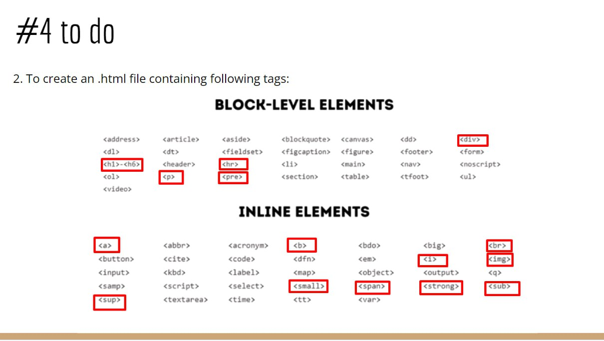

# HeadBodyTags
1. Add to the existing html document containing <head></head> tag - the body tag. Insert into body:
- 3 blocks with colors as images - at your discretion. Next to each image put the color name. When I would move the mouse over the picture I wanna see some additional information about the color.
- add all headings ordered from the last important to the most important
one
- the document has to contains 5 comments.
2. To create an .html file containing following tags:

3. Readme.md file with done execises.